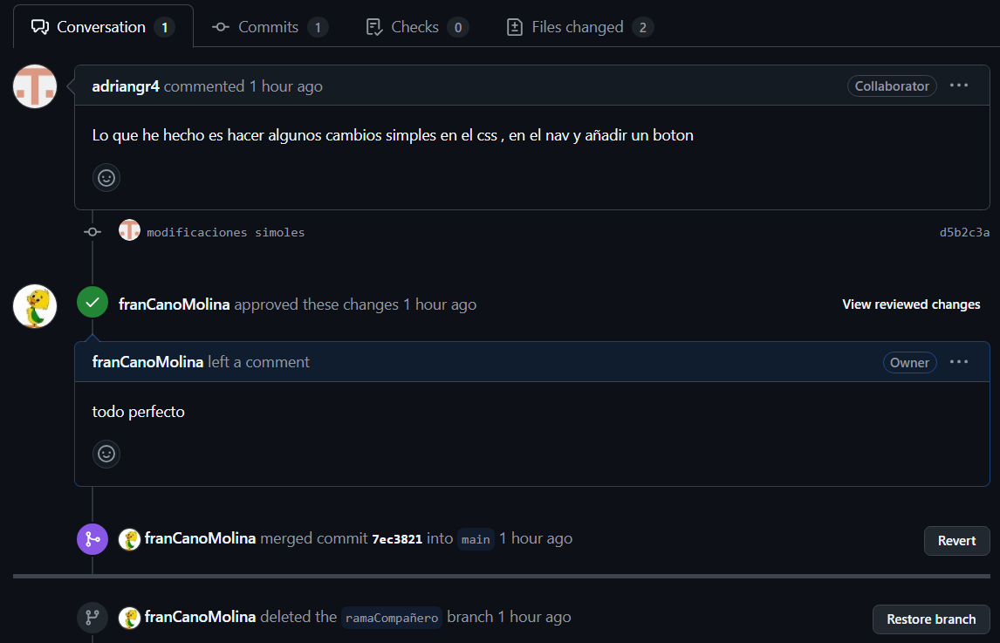

# Introducción a Git y GitHub con Vite
## PARTE 1
Empezaremos creando un repositorio en GitHub

A continuacion usaremos los siguientes comandos
```
npm create vite@latest
cd [nombre-proyecto]
npm install
```


(realizamos commit y push)

Despues de seguir estos pasos conectaremos nuestro repositorio local con el de GitHub con clave SSH:
```
git@github.com:(TU NOMBRE DE GITHUB)/(NOMBRE DE TU REPOSITORIO).git
```
## PARTE 2
Creamos las ramas "desarrolo" y "feature-ui"


(realizamos un commit)

En la rama feature-ui modificamos index html usando code "nombre del hml" para abrilo
Le añadimos una barrade de navegacion y nuestra pagina de github


(realizamos un commit)

## PARTE 3

Para esta tercera parte añadiremos a un colaborador y a nosotros nos añadiran de colaborador

Ahora clonaremos el repositorio de nuestro compañero


Y crearemos una nueva rama donde editaremos su index.html, modificacion su barra de navegacion , el css y creando un boton


Aqui podemos ver le cambio del html donde hemos creado el boton y cambiado el nombre del enlace a "Mi pagina"


A continuacion guardaremos los cambios con "git add ." y le haremos push

```
git add.
git push origin "Nombre de la rama"
```
Crearemos un pull request añadiendole iniformacion sobre los cambios que realizamos.
Asignar al propietario como reviewer
Clic en "Create pull request"


ahora de hacer nuestro pull resquest, revisaremos el que le han hecho a nuestro proyecto , lo revisaremos y en caso de que haga falta sugerir mejoras



Como ultima intruccion de la parte tres , aceptaremos el merge y si ya no e necesario eliminaremos la rama:


# Parte 4
realizamos una union de las raams main y desarrolo
```
Nos colocaremos en la rama que deseamos  llevar la informacion de la otra rama y pondremos el comandos:
git merge desarrolo
```


Por ultimo subiremos la nueva informacion , haremos un commit y un push para subirlo a nuestro repositorio github


# DIAGRAMA DE FLUJO DE TRABAJO


